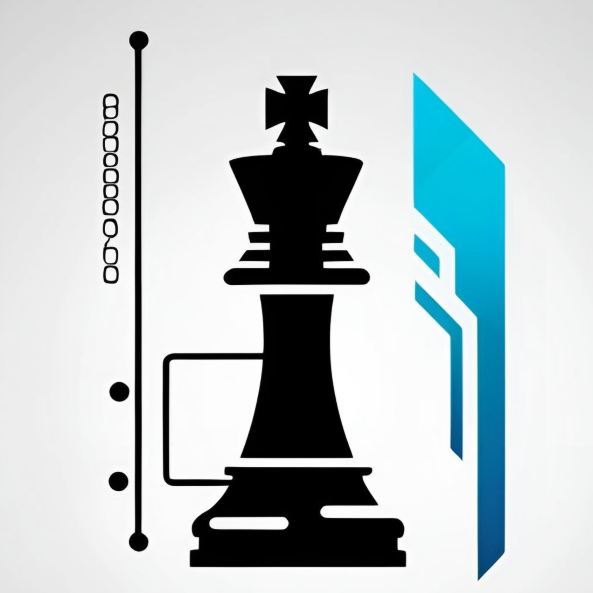

<p align="center">
  
</p>

# ChessPilot

A **fully offline** chess position evaluator and autoplayer for Windows and Linux, powered by ONNX and Stockfish.

---

## 🚀 Features

* **FEN Extraction**: Captures your board state with a local ONNX model ([Zai-Kun’s 2D Chess Detection](https://github.com/Zai-Kun/2d-chess-pieces-detection)).
* **Stockfish Analysis**: Integrates with the Stockfish engine to compute the optimal move.
* **Auto-Move Execution**: Plays the suggested move on your screen automatically.
* **Manual Play**: Click **“Play Next Move”** when you’re ready to proceed.
* **Board Flipping**: Supports playing as Black by flipping the board.
* **Castling Rights**: Toggle Kingside/Queenside castling.
* **Depth Control**: Adjust analysis depth via a slider (default: 15).
* **Retry Logic**: Retries failed moves up to three times.
* **ESC Shortcut**: Press **ESC** to reselect playing color at any time.
* **Cross-Platform GUI**: Built with Tkinter for simplicity.
* **100% Offline**: No external API calls—your data stays local.

---

## 🏷️ Badges


---

## 📦 Download

Get the latest release from the [GitHub Releases page](https://github.com/OTAKUWeBer/ChessPilot/releases/latest).

### Required Assets

1. **ONNX Model** (`chess_detectionv0.0.4.onnx`)

   * Download: [https://github.com/Zai-Kun/2d-chess-pieces-detection/releases/download/v0.0.4/chess\_detectionv0.0.4.onnx](https://github.com/Zai-Kun/2d-chess-pieces-detection/releases/download/v0.0.4/chess_detectionv0.0.4.onnx)

   > **Note (Windows)**: You may need the Microsoft Visual C++ Redistributable. Get it here: [https://learn.microsoft.com/en-us/cpp/windows/latest-supported-vc-redist?view=msvc-170](https://learn.microsoft.com/en-us/cpp/windows/latest-supported-vc-redist?view=msvc-170)

2. **Stockfish Engine**

   * Download: [https://stockfishchess.org/download/](https://stockfishchess.org/download/)

   > **Note**: Place both files in the **project root** (alongside `src/`) or inside `src/`.

---

## ⚙️ Prerequisites

* **Python** ≥ 3.10
* **Tkinter** (if missing on Linux):

  ```bash
  sudo apt install python3-tk      # Ubuntu / Debian
  sudo pacman -S tk                # Arch Linux
  sudo dnf install python3-tkinter # Fedora
  ```

Install Python dependencies:

```bash
pip install -r requirements.txt
```

* **Wayland Screenshot Tools** (Hyprland, Sway): Required for capturing board under Wayland;

  ```bash
  sudo pacman -S grim wayland-utils
  ```

---

## 🛠️ Installation

1. Clone this repository:

   ```bash
   git clone https://github.com/OTAKUWeBer/ChessPilot.git
   cd ChessPilot
   ```
2. Install dependencies:

   ```bash
   pip install -r requirements.txt
   ```
3. Add the ONNX model and Stockfish binary as described above.

---

## ▶️ Usage

From the project root:

```bash
python src/main.py
```

**Workflow**:

1. Choose **White** or **Black**.
2. Enable castling rights if needed.
3. Adjust analysis depth.
4. Select **Manual** or **Auto** play.

---

## 💻 Platform Support

* **Windows**: ✅ Tested
* **Linux**: ✅ Tested (including Wayland via `grim`)
* **macOS**: ❌ Untested (no macOS build; contributions welcome!)

---

## ⌨️ Shortcuts

See [SHORTCUTS.md](SHORTCUTS.md) for a full list.

---

## 🤝 Contributing

Contributions are welcome! Please open an issue or submit a pull request.

---

## 📜 License

This project is licensed under the MIT License. See [LICENSE](LICENSE) for details.

---

## 🙏 Acknowledgments

* **Zai-Kun** for the ONNX chess piece detector.
* **Stockfish Team** for the world’s strongest open-source engine.