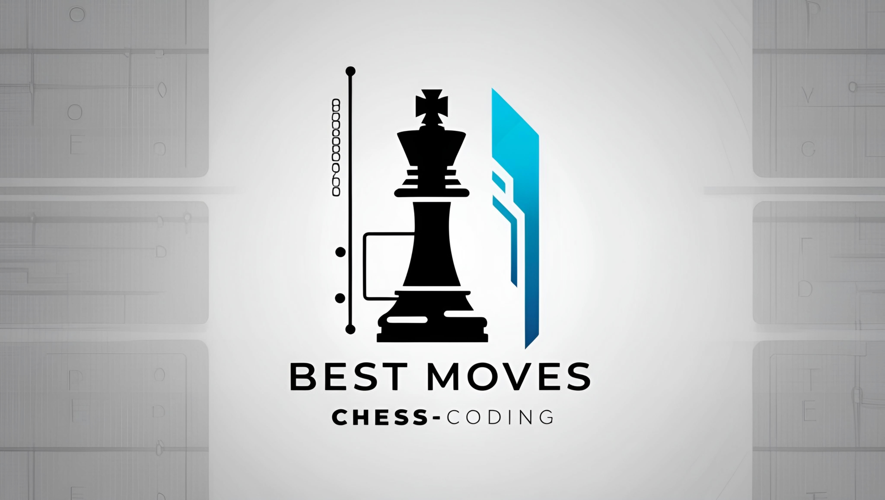

# Chess Position Evaluator

<p align="center">
  
</p>

## Features

- **FEN Extraction**: Determines the FEN of the current board position using [Zai-Kun's Chess Pieces Detection](https://github.com/Zai-Kun/2d-chess-pieces-detection), ensuring accurate move analysis.
- **Optimized Model Inference**: The local ONNX model [chess_detection.onnx](https://github.com/Zai-Kun/2d-chess-pieces-detection/releases/latest) enhances speed and eliminates external API dependencies.
- **Automatic Board Flipping**: Automatically flips the board if you’re playing as Black.
- **Stockfish Integration**: Uses the Stockfish chess engine to suggest the best move.
- **Auto Move Execution**: Automatically plays the best move suggested by Stockfish.
- **Auto Play Moves**: When enabled, the script will automatically make moves after the opponent’s move without requiring any further clicks.
- **Manual Play**: A **"Play Next Move"** button allows you to manually play the next move after you analyze the board.
- **Graphical User Interface (GUI)**: Provides a user-friendly interface instead of terminal-based interaction.
- **New Feature – ESC Key**: Allows the user to go back and select the playing color again.
- **New Feature – Castling Support**: Users can now indicate castling rights via a tick mark before each move.
- **New Feature – Depth Slider**: Users can now choose the depth for Stockfish's analysis via a slider. **Note**: More depth means longer processing time. The default depth is set to 15, which is recommended for a good balance between speed and accuracy.
- **New Feature – Retry Mechanism**: If the piece doesn’t move as expected, the tool will automatically retry the move up to **3 times**—displaying messages such as “Piece didn't move, retrying (1/3)”—to ensure the move is successfully executed.
- **Optimized Performance**: The removal of external APIs results in lower latency and improved move execution speed.

---

## Download

Get the latest release from [GitHub Releases](https://github.com/OTAKUWeBer/ChessPilot/releases/latest/).

---

## Prerequisites

Ensure the following software is installed:

- **Python 3.10+**
- **Python Libraries**:
  - `requests` (`pip install requests`)
  - `mss` (`pip install mss`)
  - `Pillow` (`pip install Pillow`)
  - `pyautogui` (`pip install pyautogui`)
  - `onnxruntime` (`pip install onnxruntime`)
  - `tkinter` (usually pre-installed with Python)
- **Stockfish Chess Engine**: [Download here](https://stockfishchess.org/)

---

## Installation

1. **Clone the Repository:**

   ```bash
   git clone https://github.com/OTAKUWeBer/ChessPilot.git
   cd ChessPilot
   ```

2. **Install Python Packages:**

   ```bash
   pip install -r requirements.txt
   ```

3. **Download the Chess Detection Model**

   - Download the chessboard detection model from [Zai-Kun’s Chess Pieces Detection](https://github.com/Zai-Kun/2d-chess-pieces-detection/releases/download/v0.0.4/chess_detectionv0.0.4.onnx)
   - Rename it as `chess_detection.onnx`
   - Place this file inside the `ChessPilot` directory (same as `main.py`).

### Linux Users

Install Stockfish via your package manager:

- **Debian/Ubuntu:**

  ```bash
  sudo apt install stockfish
  ```

- **Arch Linux:**

  ```bash
  paru/yay -S stockfish
  ```

- **Fedora:**

  ```bash
  sudo dnf install stockfish
  ```

#### Wayland Users (Hyprland, Sway)

If you're using a Wayland compositor (such as Hyprland or Sway), you'll need to install additional dependencies for screenshot functionality and screen resolution detection:

```bash
sudo pacman -S grim wayland-utils
```

### Windows Users

1. **Stockfish**:
   - Download `stockfish.exe` from [Stockfish](https://stockfishchess.org/download/), rename it to `stockfish.exe`, and place it inside the `ChessPilot` directory (same as `main.py`).

---

## Usage

1. **Run the Script:**

   ```bash
   python main.py
   ```

2. **Choose Your Color via the GUI:**

   - Click **White** if playing as White.
   - Click **Black** if playing as Black.
   - Press **ESC** to go back and re-select your color.

3. **Indicate Castling Rights:**

   - Before each move, tick the checkbox for **Kingside Castle** or **Queenside Castle**, if applicable.

4. **Choose Depth for Move:**

   - Use the slider to select the desired depth for Stockfish's analysis. **Note**: The higher the depth, the more time it will take for Stockfish to compute the best move. The default depth is set to **15**, which is suggested for optimal performance.

5. **Play the Game**:

   - **Manual Mode**: Click the **"Play Next Move"** button to manually analyze and execute your next move.
   - **Auto Mode**: Enable **"Auto Play Moves"** to let the script automatically play the next move after the opponent’s move without needing to click anything.

6. **Retry Mechanism**:

   - If the piece does not move as expected after executing a move (or castling move), the tool will automatically retry up to **3 times**.
   - During each retry, the status will display messages like **"Piece didn't move, retrying (1/3)"**.
   - Once the piece moves successfully, the tool will confirm with a success message, e.g., **"Best Move: e2e4 executed successfully after retry (2/3)."**

7. **Tips for Best Performance:**
   - Use 100% zoom for better accuracy in chessboard detection.
   - After selecting "Play next move" or enabling "Auto Play Moves," the script will:
     - Extract the FEN from the image.
     - Flip the board if playing as Black.
     - Retrieve the best move from Stockfish.
     - Automatically execute the move.
     - The best move will be displayed in the GUI.
     - For improved visibility, reposition the Tkinter window so the chessboard remains clear.
   - In Auto Mode, the script will automatically make your next move after the opponent’s move.

---

## Disclaimer

🛑 **Use at Your Own Risk**: Using this tool in online chess games may lead to account bans.

---

## License

This project is licensed under the MIT License.

---

## Contributing

Contributions are welcome! Feel free to open issues or submit pull requests if you have suggestions or improvements.

---

## Acknowledgments

- Thanks to [Zai-Kun](https://github.com/Zai-Kun) for creating the chessboard detection model.